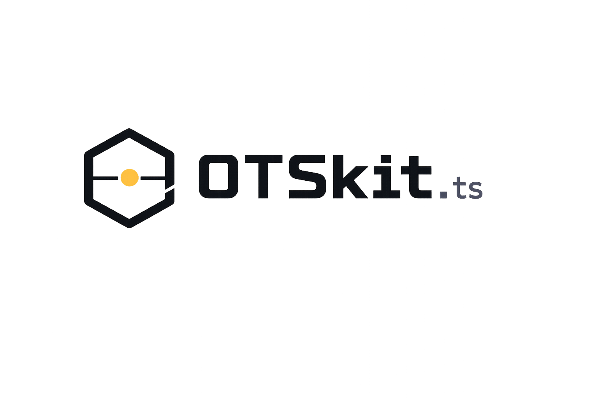

<p align="center">
  
</p>


# OTSkit

## Immutable Proof for Every AI Action

*Cryptographic proof of existence — anchored to the Bitcoin blockchain.*

Your AI agent stamps a file. Bitcoin records it forever. Even if OTSkit disappears tomorrow, the proof remains valid — verifiable by anyone using any OpenTimestamps-compatible tool.

---

## What this proves — and what it doesn't

OTSkit proves that **a specific file existed before a specific Bitcoin block**. That's it. That's the guarantee, and it's a strong one.

It does **not** prove:
- Who created the file
- That the file hasn't changed since
- Anything about legal validity in any jurisdiction

The proof is cryptographic, not legal. What it means in a legal context depends on your jurisdiction and circumstances. Consult a lawyer for use in legal proceedings.

---

## Why OTSkit

The proof lives in a `.ots` file on your machine and in the Bitcoin blockchain. No subscription, no account, no server to trust. **If OTSkit disappears tomorrow, every proof ever generated stays valid forever.**

| | OTSkit | OriginStamp | OpenTimestamps CLI | getAlby/ots-mcp |
|---|---|---|---|---|
| Cost per stamp | Free | ~$12K/yr (500K stamps) | Free | Free |
| Proof format | .ots (open standard) | Proprietary (JSON/PDF) | .ots (open standard) | .ots (open standard) |
| Works if service disappears | ✅ Always | ⚠️ Only if you downloaded the proof | ✅ Always | ✅ Always |
| TypeScript SDK | ✅ Native | ⚠️ Abandoned (2021) | ⚠️ Exists, not primary | ❌ |
| MCP integration (AI agents) | ✅ 8 tools | ❌ | ❌ | ✅ 6 tools |
| Local persistence (SQLite) | ✅ | ❌ Cloud only | ❌ Files only | ❌ |
| Auto-upgrade scheduler | ✅ | ❌ | ❌ | ❌ |
| Resilience (circuit breakers) | ✅ Per-calendar | ❌ | ⚠️ Partial | ❌ |
| OAIS / PREMIS preservation | ✅ via Skills | ❌ | ❌ | ❌ |
| Open source | ✅ MIT | ⚠️ SDKs archived | ✅ LGPL | ✅ MIT |

---

## Use cases

**AI agent audit trail** — Every document your agent processes gets a tamper-proof timestamp. Prove what your agent did, on what file, and when.

**File integrity** — Stamp contracts, reports, or source code. Verify later that nothing changed.

**Software releases** — Timestamp each build artifact or SBOM. Prove your release existed before a specific date.

**Digital preservation** — Generate OAIS/PREMIS-compliant preservation packages anchored to Bitcoin.

---

## The ecosystem

| Package | What it does |
|---|---|
| [`@otskit/core`](https://github.com/OTSkit/otskit-core) | OpenTimestamps protocol engine — zero dependencies, TypeScript-native |
| [`@otskit/client`](https://github.com/OTSkit/otskit-client) | Production SDK with circuit breakers, SSRF protection, auto-retry |
| [`@otskit/mcp`](https://github.com/OTSkit/OTSkit-MCP) | MCP server — 8 tools for Claude, Codex, and any MCP-compatible agent |
| [OTSkit Skills](https://github.com/OTSkit/SKILLS) | Agent skills for BagIt/OAIS/PREMIS digital preservation workflows |

---

## Quick start

> New to MCP? → [5-minute setup guide for Claude Desktop](https://github.com/OTSkit/OTSkit-MCP#agent-setup)

```bash
npm install -g @otskit/mcp
ots-mcp setup claude-code   # or: claude, codex
```

Restart your agent and ask: *"Stamp this file and prove it exists on Bitcoin."*

---

*MIT License · Built on the [OpenTimestamps](https://opentimestamps.org/) open standard*
